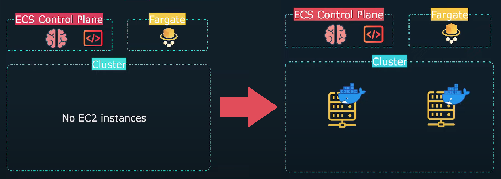
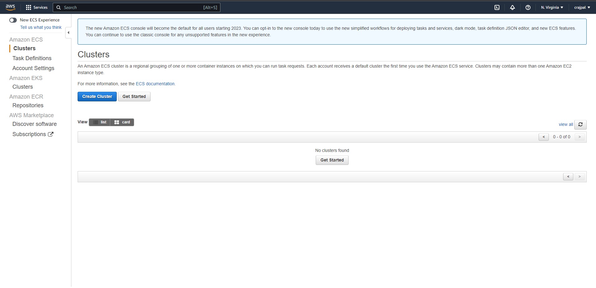
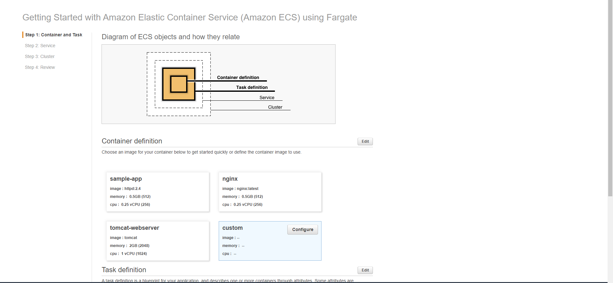
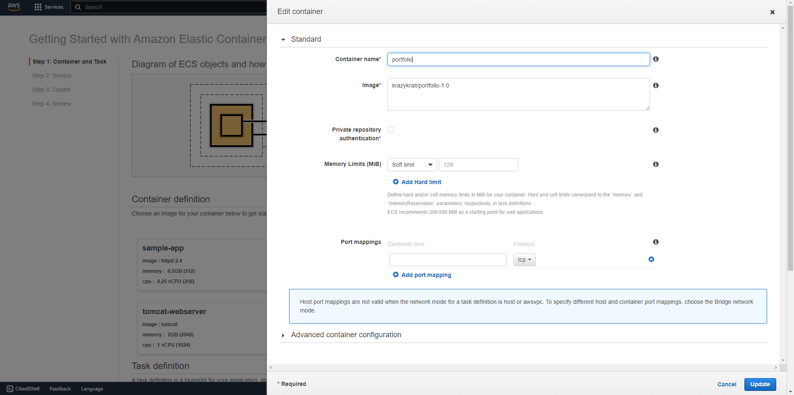
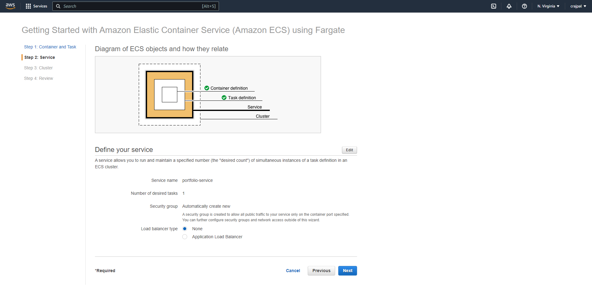
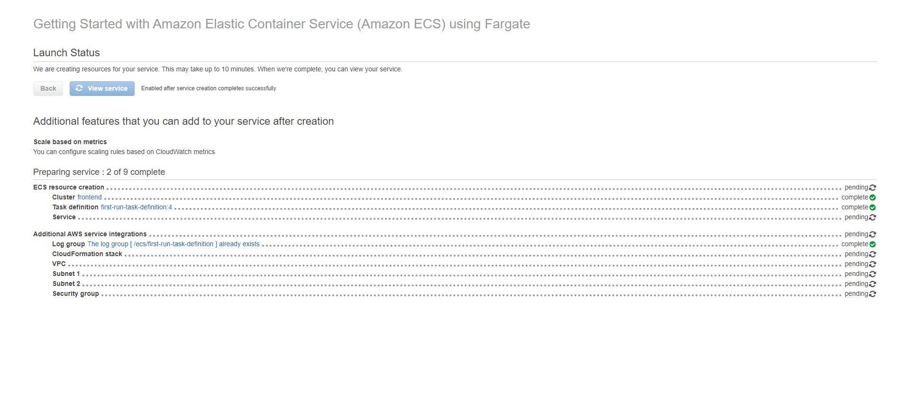
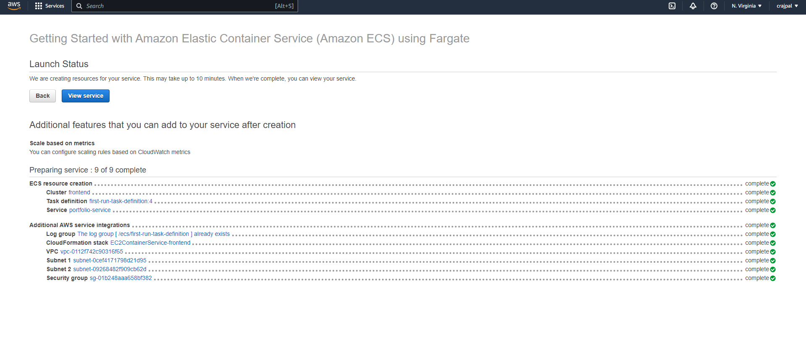
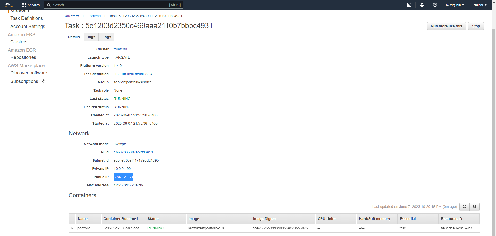
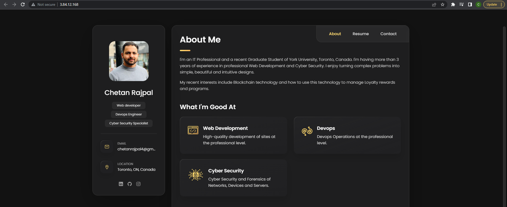

# AWS Elastic Container Service practice

 ECS is aws's managed container orchestrator and so being an orchestrator it's going to put it in the same family as a Docker swarm or a kubernetes but this is just one that's provided by AWS and is managed by AWS exclusively. ECS is also responsible for deploying and load balancing the application across multiple servers, with Docker or Docker compose it's kind of limited.
 
 Now there are two ways to deploy containers using ECS. ECS + Fargate and ECS + EC2.
 
 ## ECS + Fargate
 
 With ECS Fargate, AWS is now going to manage the underlying infrastructure for me. I’m going to have the ECS control plane and my cluster just like before, but now I’m also going to have this thing called Fargate. It follows a serverless architecture. This means that when I take a look at my cluster, I’m going to see that there are no EC2 instances, there’s nothing there. That’s just like how serverless operates, where there are no physical servers. But when I go and create an application and send it to ECS, what ECS is going to do is it’s going to see that I have no servers to run my application on, so it’s going to talk to Fargate and Fargate will create the servers on demand. It’s going to actually create the underlying resources. Fargate is going to handle all of that and once those instances get created, now ECS can then deploy my containers onto that newly created infrastructure. The great part about this is that I do not need to provision or maintain the EC2 servers. Fargate does all of that for me under the hood and the nice part about this is that I only pay for what I use. So if I delete my application or scale it down, it’s going to remove the underlying resources so I’m not paying for an EC2 server that’s just constantly running all the time.
 
 
 
 ## Screenshots for Fargate -
 
 ### 1
 
 
 
 ### 2
 
 
 
 ### 3
 
 
 
 ### 4
 
 
 
 ### 5
 
 
 
 ### 6
 
 
 
 ### 7
 
 
 
 ### 8
 
 
 
 