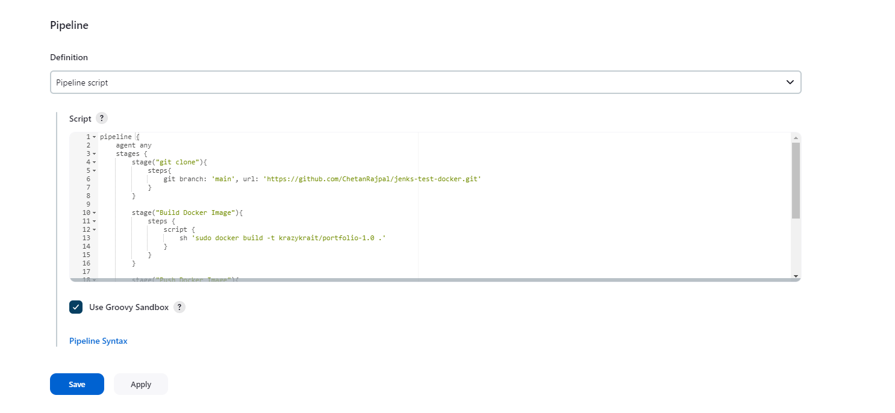
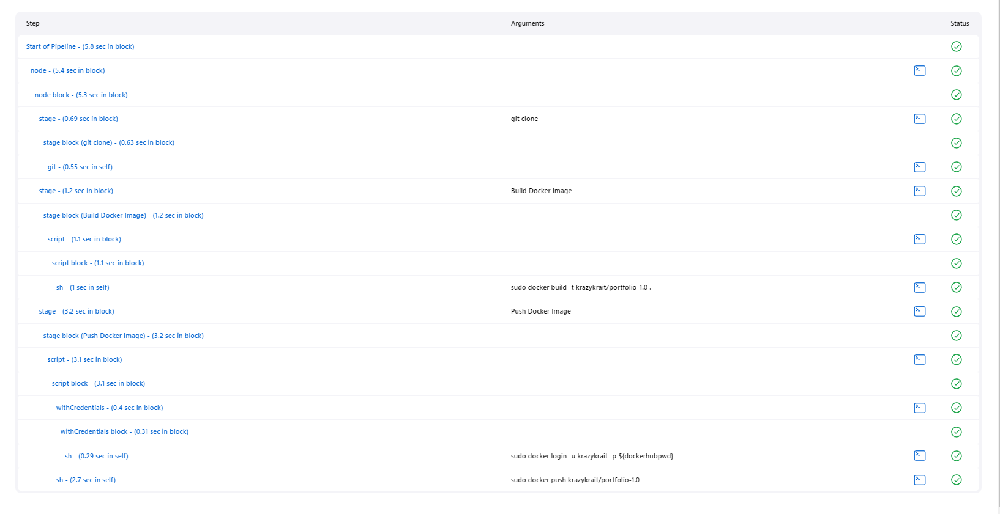
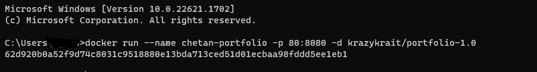
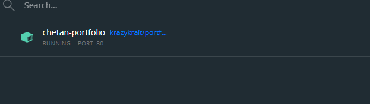

# Jenkins Docker Integration

 I used jenkins pipeline to create docker image of my portfolio and then pushed the image to dockerhub.

    pipeline {
        agent any
        stages {
            stage("git clone"){
                steps{
                  git branch: 'main', url: 'https://github.com/ChetanRajpal/jenks-test-docker.git'
                }
            }
        
            stage("Build Docker Image"){
               steps {
                   script {
                       sh 'sudo docker build -t krazykrait/portfolio-1.0 .'
                    }
                }
            }
        
            stage("Push Docker Image"){
                steps {
                    script {
                          withCredentials([string(credentialsId: 'krazykrait', variable: 'dockerhubpwd')]) {
                          sh 'sudo docker login -u krazykrait -p ${dockerhubpwd}'
                          }
                       
                          sh 'sudo docker push krazykrait/portfolio-1.0'
                    }
                }
            }
        }
    }

 after that I used coomand `docker run --name chetan-portfolio -p 80:8080 -d krazykrait/portfolio-1.0`
 
 ## Screenshots -
 
 ### 1
 
 
 
 ### 2
 
 
 
 ### 3
 
 
 
 ### 4
 
 
 
 ### 5
 
 
 
 