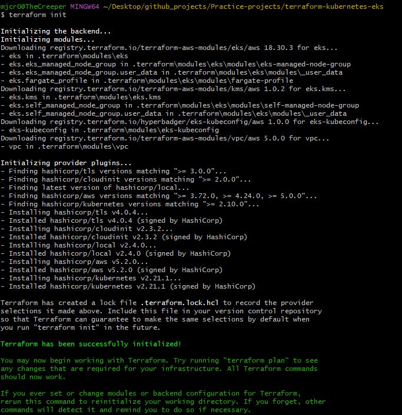
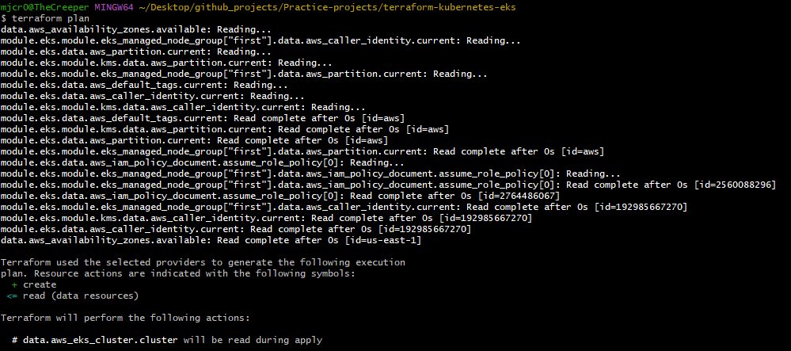
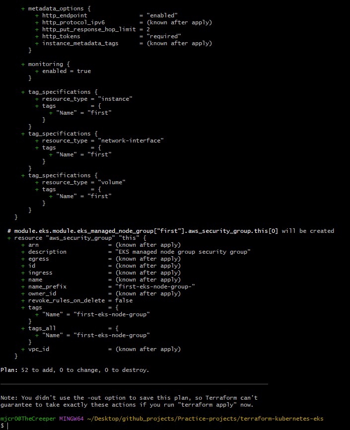
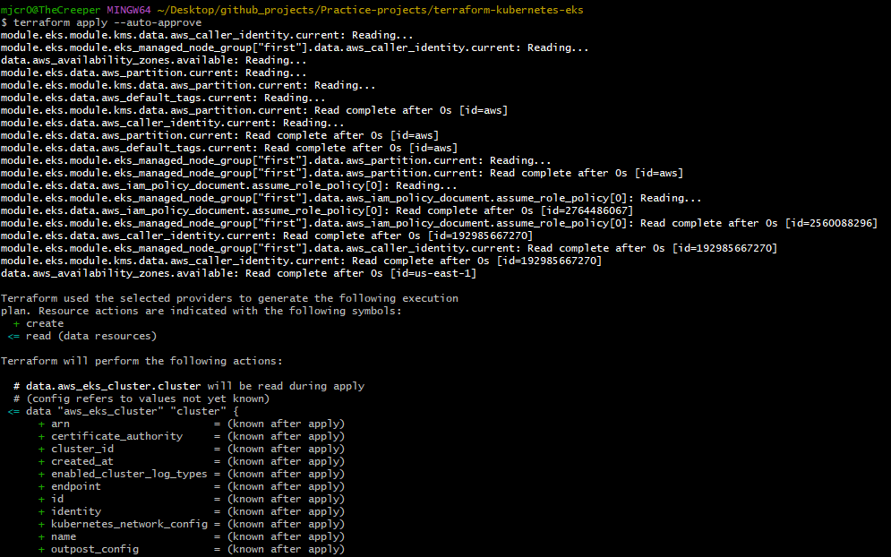
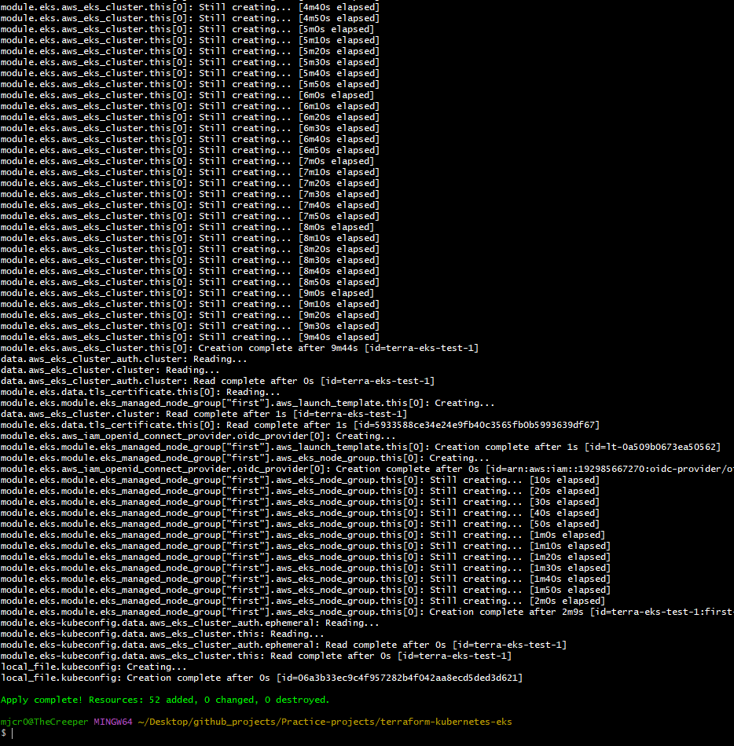
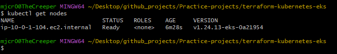
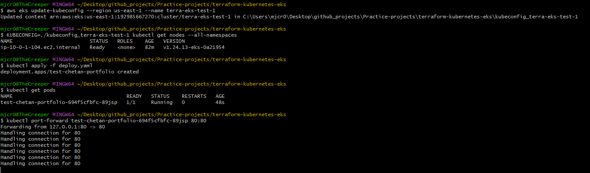
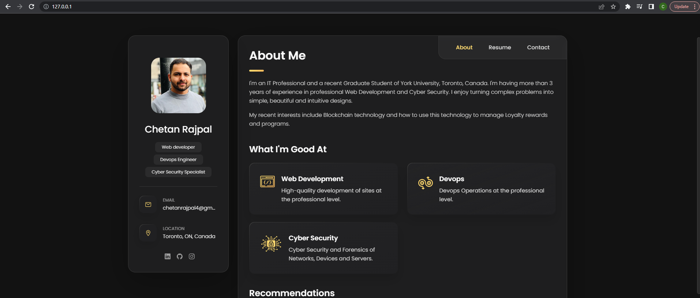

# EKS Kubernetes Cluster Deployment using Terraform

 I used terraform to deploy an EKS cluster. The terraform script is follows as given below

    provider "aws" {
      region = "us-east-1"
    }
    
    data "aws_availability_zones" "available" {}
    
    data "aws_eks_cluster" "cluster" {
      name = module.eks.cluster_id
    }
    
    data "aws_eks_cluster_auth" "cluster" {
      name = module.eks.cluster_id
    }
    
    locals {
      cluster_name = "terra-eks-test-1"
    }
    
    provider "kubernetes" {
      host                   = data.aws_eks_cluster.cluster.endpoint
      cluster_ca_certificate = base64decode(data.aws_eks_cluster.cluster.certificate_authority.0.data)
      token                  = data.aws_eks_cluster_auth.cluster.token
    }
    
    module "eks-kubeconfig" {
      source     = "hyperbadger/eks-kubeconfig/aws"
      version    = "1.0.0"
    
      depends_on = [module.eks]
      cluster_id =  module.eks.cluster_id
      }
    
    resource "local_file" "kubeconfig" {
      content  = module.eks-kubeconfig.kubeconfig
      filename = "kubeconfig_${local.cluster_name}"
    }

    module "vpc" {
      source  = "terraform-aws-modules/vpc/aws"
      version = "5.0.0"
    
      name                 = "test-eks-vpc"
      cidr                 = "10.0.0.0/16"
      azs                  = data.aws_availability_zones.available.names
      private_subnets      = ["10.0.1.0/24", "10.0.2.0/24", "10.0.3.0/24"]
      public_subnets       = ["10.0.4.0/24", "10.0.5.0/24", "10.0.6.0/24"]
      enable_nat_gateway   = true
      single_nat_gateway   = true
      enable_dns_hostnames = true
    
      public_subnet_tags = {
        "kubernetes.io/cluster/${local.cluster_name}" = "shared"
        "kubernetes.io/role/elb"                      = "1"
      }
    
      private_subnet_tags = {
        "kubernetes.io/cluster/${local.cluster_name}" = "shared"
        "kubernetes.io/role/internal-elb"             = "1"
      }
    }
    
    module "eks" {
      source  = "terraform-aws-modules/eks/aws"
      version = "18.30.3"
    
      cluster_name    = "${local.cluster_name}"
      cluster_version = "1.24"
      subnet_ids      = module.vpc.private_subnets
    
      vpc_id = module.vpc.vpc_id
    
      eks_managed_node_groups = {
        first = {
          desired_capacity = 2
          max_capacity     = 2
          min_capacity     = 1
    
          instance_type = "t2.micro"
        }
      }
    }
	
 
 ## Screenshots -
 
 ### 1
 
 
 
 ### 2
 
 
 
 ### 3
 
 
 
 ### 4
 
 
 
 ### 5
 
 
 
  ### 6
 
 
 
  ### 7
 
 
 
  ### 8
 
 
 
 